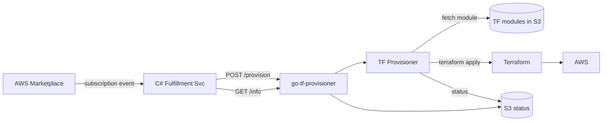

# go-tf-provisioner

HTTP service that runs Terraform modules on demand to provision customer-specific infrastructure. Built to sit behind an AWS Marketplace fulfillment flow: when a customer subscribes to a product, the marketplace integration calls this service, which fetches the product's Terraform module from S3, applies it, and exposes status for polling.

## How it works

- `POST /provision` — submit a provisioning job for a `customerId` + `productCode`. The request is validated, a running-status slot is claimed in S3 (so duplicate submissions for the same customer/product return `409`), and Terraform is applied asynchronously in a background goroutine.
- `GET /info?customerId=...&productCode=...` — list job statuses for a customer (optionally filtered by product). Statuses include `running`, `succeeded`, or `failed`, plus any module outputs.
- `GET /healthz` — liveness check.

Terraform state lives in S3 with a DynamoDB lock table. Modules are pulled from a separate S3 bucket keyed by product code and cached locally per run.

## Flow



## Running

```bash
go build ./...
./go-tf-provisioner serve
```

Required environment:

| Var                       | Purpose                                            |
| ------------------------- | -------------------------------------------------- |
| `AWS_REGION`              | Default AWS region for the service                 |
| `TF_MODULE_BUCKET`        | S3 bucket containing per-product Terraform modules |
| `TF_STATUS_BUCKET`        | S3 bucket for job-status JSON objects              |
| `TF_STATE_BUCKET`         | S3 bucket for Terraform remote state               |
| `TF_STATE_DYNAMODB_TABLE` | DynamoDB table for state locking                   |

Optional: `PORT` (default `8080`), `TF_STATE_REGION`, `TF_BINARY_PATH`, `TF_WORK_DIR`, `TF_PLUGIN_CACHE_DIR`, `TF_JOB_TIMEOUT`, `AWS_ENDPOINT_URL` (for LocalStack).
